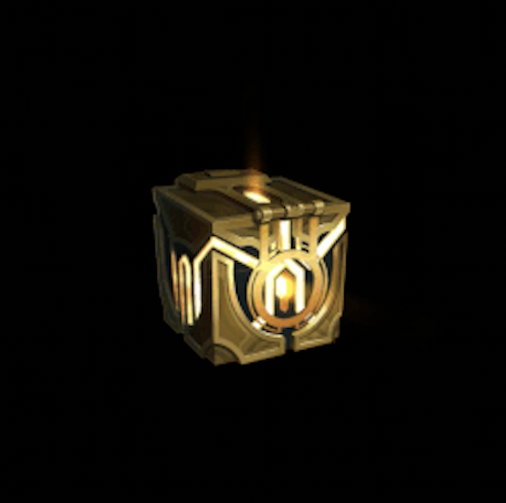

<!DOCTYPE html>
<html lang="ko">
<head>
<meta charset="UTF-8">
<meta name="viewport" content="width=device-width, initial-scale=1.0">
<title>whomadethis_site?!</title><!-- [변경] 사이트 제목 변경 가능 -->

</head>
<body>

<h1>To. 대주주 봉지퐁지</h1>
 <!-- [변경] 제목 변경 가능 -->

    

<button id="openButton">열어봐</button> 

<!-- 🎈 이미지 컨테이너 -->

</body>
</html>
